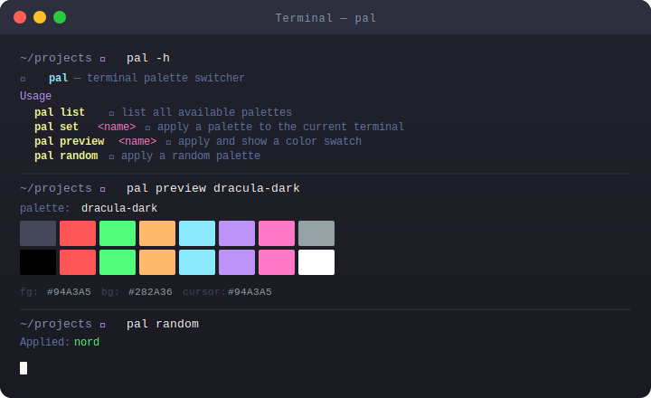
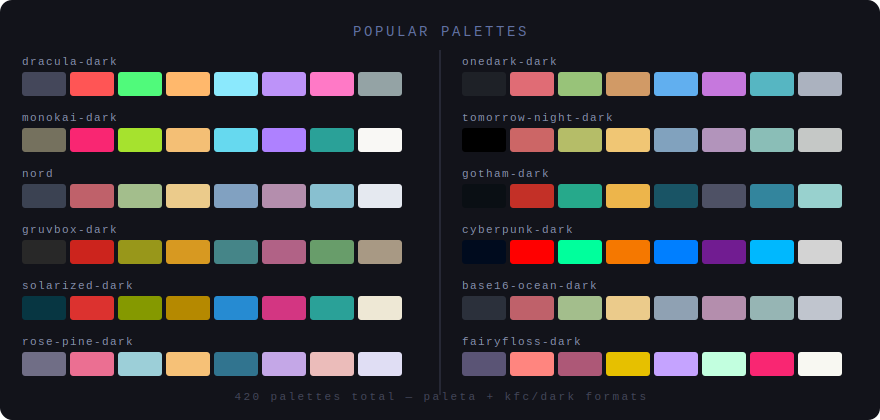

<div align="center">


<br/>

[](https://golang.org)
[](palettes/)
[](#)
[](LICENSE)

**Switch your terminal's color palette instantly.
420 themes compiled into a single static binary. No config. No runtime deps.**

</div>

---

## ✨ Features

- 🎨 **420 palettes** — dracula, nord, gruvbox, monokai, solarized, rose-pine, and hundreds more
- ⚡ **Instant** — writes OSC escape sequences directly to stdout, takes effect immediately
- 📦 **Self-contained** — all palette data compiled in via `//go:embed`, nothing to install separately
- 🖥️ **Cross-terminal** — works in xterm, VTE, iTerm2, Kitty, Alacritty, WezTerm, and more
- 🎲 **Random mode** — explore palettes with `pal random`
- 📋 **Shell export** — dump a theme as shell code for your `.bashrc` / `.zshrc`

---

## 🖥️ Demo

<div align="center">

</div>

---

## 🎨 Palette Showcase

<div align="center">

</div>

---

## 📦 Install

### Homebrew (macOS)
```bash
brew install binRick/tap/pal
```

### Build from source
```bash
git clone https://github.com/binRick/pal
cd pal
go build -o pal .
sudo mv pal /usr/local/bin/
```

### Static binary (Docker, no Go required)
```bash
./build.sh          # produces ./pal (fully static, no libc)
sudo mv pal /usr/local/bin/
```

---

## 🚀 Usage

```
pal list                 📋 list all 420 available palettes
pal set <name>           🖌  apply a palette to the current terminal
pal preview <name>       👁  apply and show a color swatch
pal random               🎲 apply a random palette
pal export <name>        📄 print shell code to apply the palette (for .bashrc)
pal <name>               ⚡ shorthand for "pal set <name>"
```

### Quick examples

```bash
# Apply a theme
pal dracula-dark
pal nord
pal monokai-dark

# Preview with color swatches
pal preview rose-pine-dark

# Random theme
pal random

# Search for themes by keyword
pal list | grep gruvbox

# Export to .bashrc — no pal binary needed at shell startup
pal export dracula-dark >> ~/.bashrc
```

---

## 📄 Shell Export

`pal export <name>` prints the raw OSC escape sequences as a shell `printf` one-liner.
Paste it into your `.bashrc` or `.zshrc` to apply the palette on every terminal open —
**no `pal` binary required at runtime**.

```bash
$ pal export dracula-dark
printf '\033]4;0;#44475A\033\\\033]4;1;#FF5555\033\\ ... \033]11;#282A36\033\\'
```

Add to your shell profile:
```bash
echo "$(pal export dracula-dark)" >> ~/.bashrc
```

---

## 🎨 All Palettes

<details>
<summary>Click to expand — 420 palettes across two formats</summary>

### Base16 family
`base16-3024-dark` · `base16-ashes-dark` · `base16-bespin-dark` · `base16-brewer-dark` · `base16-chalk-dark` · `base16-codeschool-dark` · `base16-default-dark` · `base16-dracula` · `base16-eighties-dark` · `base16-embers-dark` · `base16-google-dark` · `base16-grayscale-dark` · `base16-gruvbox-hard` · `base16-gruvbox-medium` · `base16-gruvbox-soft` · `base16-isotope-dark` · `base16-londontube-dark` · `base16-monokai-dark` · `base16-nord` · `base16-ocean-dark` · `base16-onedark` · `base16-paraiso-dark` · `base16-railscasts-dark` · `base16-solarized-dark` · `base16-tomorrow-night` · `base16-twilight-dark` · and many more

### Popular editor themes
`dracula-dark` · `monokai-dark` · `nord` · `gruvbox-dark` · `solarized-dark` · `solarized-light` · `rose-pine-dark` · `onedark-dark` · `tomorrow-night-dark` · `gotham-dark` · `cyberpunk-dark` · `fairyfloss-dark` · `night-owl-dark` · `vscode` · `atom-dark` · `ayu-dark` · `afterglow-dark` · `challenger-deep`

### DKEG designer series
`dkeg-amiox` · `dkeg-bark` · `dkeg-blend` · `dkeg-blok` · `dkeg-branch` · `dkeg-coco` · `dkeg-corduroy` · `dkeg-depth` · `dkeg-fury` · `dkeg-gotham` · `dkeg-kit` · `dkeg-leaf` · `dkeg-lumen` · `dkeg-owl` · `dkeg-poly` · `dkeg-shade` · `dkeg-sprout` · `dkeg-subtle` · `dkeg-urban` · `dkeg-victory` · and 30+ more

### Tempus series
`tempus_autumn` · `tempus_classic` · `tempus_day` · `tempus_dusk` · `tempus_future` · `tempus_night` · `tempus_rift` · `tempus_spring` · `tempus_summer` · `tempus_tempest` · `tempus_warp` · `tempus_winter`

### Sexy themes
`sexy-dracula` · `sexy-monokai` · `sexy-gotham` · `sexy-material` · `sexy-hybrid` · `sexy-tango` · `sexy-neon` · `sexy-zenburn` · and 50+ more

</details>

---

## ⚙️ How It Works

`pal` applies color palettes using **OSC (Operating System Command) escape sequences** — the same mechanism used by terminal emulators like iTerm2's built-in theme switcher.

```
\033]4;N;#RRGGBB\033\   →  set palette color N (0–15)
\033]10;#RRGGBB\033\    →  set foreground color
\033]11;#RRGGBB\033\    →  set background color
\033]12;#RRGGBB\033\    →  set cursor color
```

These sequences are written to stdout and interpreted live by your terminal. **No restart required** — the change takes effect immediately.

### Palette formats

Two formats from [`c_palettes`](https://github.com/binRick/c_palettes) are supported and compiled in:

| Format | Location | Structure |
|--------|----------|-----------|
| `paleta` | `palettes/paleta/` | 19-line hex values: fg, bg, cursor, then colors 0–15 |
| `kfc` | `palettes/kfc/dark/` | `key=value` pairs: `color00=rrggbb`, `foreground=rrggbb`, … |

---

## 🐳 Static Build

Build a fully static binary (no libc, no cgo) using Docker:

```bash
./build.sh
```

The output `./pal` binary runs on any Linux x86_64 — drop it anywhere and it works.

---

## 📁 Project Structure

```
pal/
├── main.go              CLI — parse, embed, apply, export
├── go.mod               module: github.com/binRick/pal
├── build.sh             Docker static build script
├── docs/
│   ├── banner.svg       Hero banner
│   ├── demo.svg         Terminal demo screenshot
│   └── palettes.svg     Palette showcase grid
└── palettes/
    ├── paleta/          169 paleta-format themes
    └── kfc/dark/        251 kfc-format dark themes
```

---

## 🙏 Credits

Palette data sourced from [binRick/c_palettes](https://github.com/binRick/c_palettes), a C-based terminal palette manager with an extensive collection of curated themes.

---

<div align="center">
<sub>Built with Go · OSC escape sequences · <code>//go:embed</code></sub>
</div>
